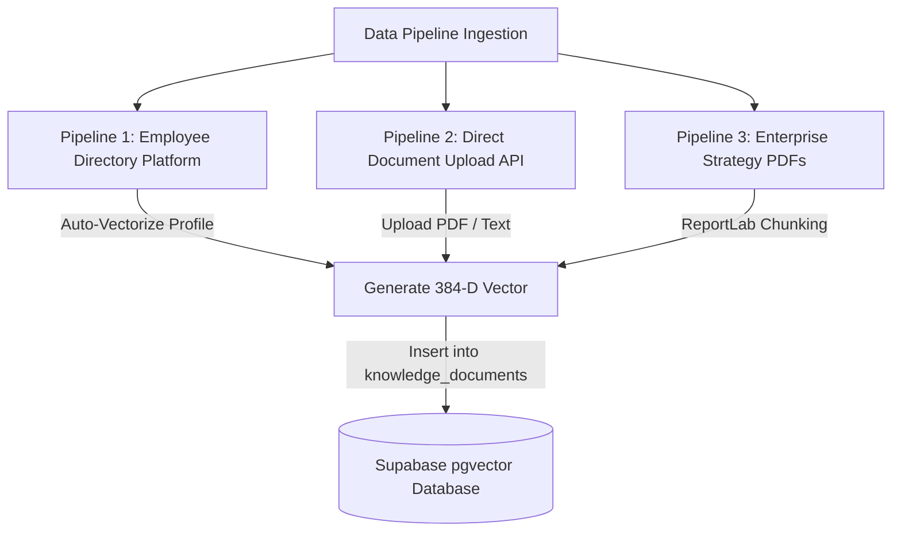

# LEROY AI // ARCHITECTURE & VECTOR RAG TECHNICAL GUIDE

Welcome to the comprehensive technical documentation for **Leroy AI** — an enterprise-grade Revenue Optimization & Human Capital Intelligence Copilot powered by **React**, **FastAPI**, **LangChain**, **LangGraph**, **Groq LLaMA-3.3 LLM**, and **Supabase `pgvector`**.

---

## 🛠️ 1. End-to-End System Architecture

```mermaid
sequenceDiagram
    autonumber
    actor Exec as Executive User
    participant FE as React Bloomberg UI (Port 3000)
    participant API as FastAPI Backend (Port 8000)
    participant LG as LangGraph Workflow Pipeline
    participant ST as SentenceTransformer (all-MiniLM-L6-v2)
    participant Supa as Supabase (PostgreSQL + pgvector)
    participant LLM as Groq Engine (LLaMA-3.3 70B)

    Exec->>FE: Type query (e.g., "Which rep generates highest ARR?")
    FE->>API: POST /api/chat { query }
    
    API->>LG: Invoke LangGraph Agent Pipeline
    
    rect rgb(15, 23, 42)
        Note over LG: Node 1: Intent Router
        LG->>LG: Classify intent (EMPLOYEE_HR / REVENUE_OPT / GREETING)
        
        Note over LG, ST: Node 2: Vector Retriever
        LG->>ST: Encode query string -> 384-D dense float vector
        ST-->>LG: Return 384-dimensional query vector array
        
        LG->>Supa: Call match_documents(query_embedding, match_count=4)
        Supa-->>LG: Return top k matching vector chunks (Cosine Similarity)
        
        Note over LG: Node 3: Analytics Engine
        LG->>Supa: Fetch live telemetry (ARR $4.85M, MRR $404K, NRR 118.5%)
        
        Note over LG, LLM: Node 4: Response Generator
        LG->>LLM: Pass (System Prompt + Telemetry + Retrieved Vectors + Query)
        LLM-->>LG: Return structured markdown executive intelligence briefing
    end
    
    LG-->>API: Return response + LangGraph Execution Trace + Vector Sources
    API-->>FE: HTTP 200 OK JSON Response
    FE-->>Exec: Render formatted Bloomberg Terminal markdown & trace drawer
```



---

## 🧠 2. How Vector Embeddings Are Generated

### What is an Embedding?
An **embedding** is a numerical representation of textual meaning. Instead of matching exact keywords (like traditional SQL `LIKE %sales%`), vector embeddings convert unstructured text (sentences, paragraphs, PDFs, employee bios) into a high-dimensional vector space where **concepts with similar meanings sit close together**.

### The Embedding Model: `all-MiniLM-L6-v2`
- **Dimensions**: **384 numbers** (e.g. `[-0.0245, 0.0812, 0.0394, ..., 0.1042]`)
- **Library**: `sentence-transformers` in Python
- **Speed**: Ultra-fast CPU/GPU inference (~5ms per text chunk)

### Code Implementation (`backend/db.py`)
```python
from sentence_transformers import SentenceTransformer

# Load embedding model locally
embedding_model = SentenceTransformer('all-MiniLM-L6-v2')

def generate_embedding(text: str) -> List[float]:
    """Converts input text string into a 384-dimensional dense vector."""
    vector = embedding_model.encode(text)
    return vector.tolist()  # Returns list of 384 floats
```

---

## 📥 3. How Data is Collected & Fed into the Knowledge Base

Leroy AI automatically ingests data from **three distinct operational pipelines**:



### Pipeline 1: Integrated Employee Platform (Auto-RAG Feed)
Whenever an executive creates or updates an employee in the UI (`EmployeePlatform.jsx`), Leroy AI automatically generates a natural language summary of that employee's profile and converts it into a vector chunk:

```python
# Auto-generated knowledge chunk from Employee creation
emp_bio_doc = (
    f"Employee Profile: {name} | Role: {role} | Department: {department} | "
    f"Revenue Contribution: ${revenue:,.2f} ARR | Performance Score: {rating}/10. "
    f"Skills: {skills}. Background & Achievements: {bio}"
)

# Embedded and stored in Supabase under category 'employee_intel'
db.add_knowledge_document(
    title=f"Employee Intel - {name}",
    category="employee_intel",
    content=emp_bio_doc,
    source_type="employee_profile"
)
```

### Pipeline 2: Document Upload API (`/api/knowledge`)
Users can upload custom strategy playbooks, pricing policies, and market benchmarks via the UI (`KnowledgeBaseExplorer.jsx`). The text is processed, embedded, and stored in Supabase.

### Pipeline 3: PDF Document Parsing & Script Ingestion (`create_company_pdf_and_ingest.py`)
Corporate strategy PDFs are automatically split into logical text blocks (company overview, product tiering, financial goals, sales playbooks) and vectorized into Supabase.

---

## ⚡ 4. How Things Work in Supabase `pgvector`

Supabase uses **PostgreSQL** with the official **`pgvector` extension** to perform high-performance vector similarity searches inside the database.

### 1. Database Schema (`backend/supabase_schema.sql`)

```sql
-- Enable vector extension in PostgreSQL
CREATE EXTENSION IF NOT EXISTS vector;

-- Knowledge Base Vector Table
CREATE TABLE IF NOT EXISTS knowledge_documents (
    id UUID PRIMARY KEY DEFAULT gen_random_uuid(),
    title VARCHAR(255) NOT NULL,
    category VARCHAR(100) NOT NULL,
    content TEXT NOT NULL,
    embedding vector(384), -- Stored 384-dimensional dense vector
    metadata JSONB DEFAULT '{}'::jsonb,
    source_type VARCHAR(50) DEFAULT 'document',
    created_at TIMESTAMP WITH TIME ZONE DEFAULT NOW()
);
```

### 2. Fast Indexing with `IVFFlat`
To query millions of vectors in milliseconds, an **Inverted File Flat (`ivfflat`)** index is built on the `embedding` column using **Cosine Vector Distance (`vector_cosine_ops`)**:

```sql
CREATE INDEX IF NOT EXISTS knowledge_docs_embedding_idx 
ON knowledge_documents 
USING ivfflat (embedding vector_cosine_ops)
WITH (lists = 100);
```

### 3. Vector Similarity Search Function (`match_documents`)
When a user asks Leroy AI a query, Leroy AI calls a custom Stored Procedure (`RPC`) in Supabase to find the top $k$ most relevant documents using the **cosine distance operator (`<=>`)**:

```sql
CREATE OR REPLACE FUNCTION match_documents (
  query_embedding vector(384),
  match_count int DEFAULT 5,
  filter_category text DEFAULT NULL
)
RETURNS TABLE (
  id UUID,
  title VARCHAR(255),
  category VARCHAR(100),
  content TEXT,
  similarity float,
  metadata JSONB,
  source_type VARCHAR(50)
)
LANGUAGE plpgsql
AS $$
BEGIN
  RETURN QUERY
  SELECT
    kd.id,
    kd.title,
    kd.category,
    kd.content,
    -- Convert Cosine Distance (<=>) into Similarity Score (1.0 = Exact Match)
    1 - (kd.embedding <=> query_embedding) AS similarity,
    kd.metadata,
    kd.source_type
  FROM knowledge_documents kd
  WHERE (filter_category IS NULL OR kd.category = filter_category)
  ORDER BY kd.embedding <=> query_embedding
  LIMIT match_count;
END;
$$;
```

### 4. Row Level Security (RLS) Configuration
By default, Supabase turns ON Row Level Security on new PostgreSQL tables. For public client API access during development, RLS is disabled:

```sql
ALTER TABLE employees DISABLE ROW LEVEL SECURITY;
ALTER TABLE revenue_metrics DISABLE ROW LEVEL SECURITY;
ALTER TABLE knowledge_documents DISABLE ROW LEVEL SECURITY;
```

---

## 🎯 Summary Checklist

| Concept | Implementation in Leroy AI |
| :--- | :--- |
| **LLM Inference** | Groq API (`llama-3.3-70b-versatile`) |
| **Orchestration** | LangGraph StateGraph (Router → Retriever → Analytics → Generator) |
| **Vector Embeddings** | `SentenceTransformer('all-MiniLM-L6-v2')` (384 dimensions) |
| **Vector Storage** | Supabase PostgreSQL with `pgvector` extension |
| **Similarity Math** | Cosine Similarity via `<=>` operator (`1 - distance`) |
| **UI Aesthetics** | Bloomberg Terminal theme (React + Vite + Monospace JetBrains CSS) |
